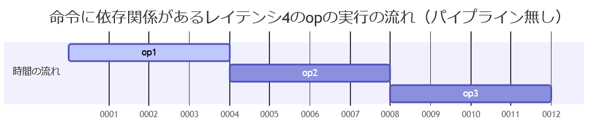
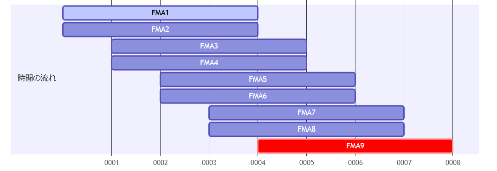
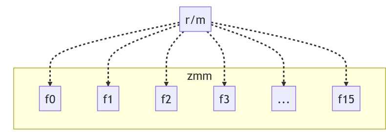
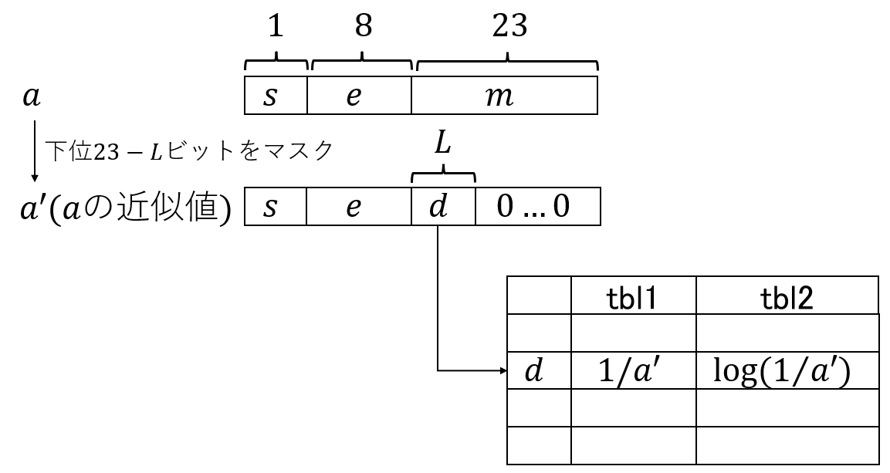
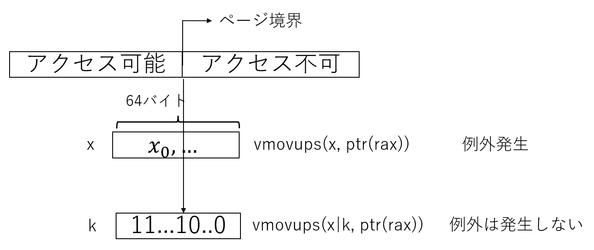

<!--
headingDivider: 1
-->

<!--
_class: title
-->
# SIMDの基礎と関数の実装例
<br>
<br>
サイボウズ・ラボ 光成滋生
<br>
計算科学技術特論A（2023） 2023/6/29

# 概要
## 目次
1. 背景
1. 自作アセンブラ
1. SIMD
1. x64 CPU
1. レイテンシとスループット
1. FMA
1. exp(x)
1. log(x)
1. マスクレジスタ

# 背景
## 優れたライブラリやツールは沢山ある
- わざわざ自分で開発する必要はない
  - 
  - [行列計算における高速アルゴリズム１](https://www.docswell.com/s/2300203199/ZQ81DV-2023-05-22-102059#p20)より引用
- が、それらのコードがアセンブリ言語（以下ASM）で記述されることが多いのも事実
  - 将来、もしかしたら自分が開発に関わるかもしれない
  - ASM/SIMD（特にx64のAVX-512）を紹介する

# 自作アセンブラ
## [xbyak](https://github.com/herumi/xbyak) : x64用の動的なコードを生成するC++ライブラリ
  - Intel [oneAPI(oneDNN)](https://github.com/oneapi-src/oneDNN)のCPUエンジンで利用されている
  - oneDNNはPyTorchやTensorFlowなどのIntel版で使われている
  - [チップレットになった「第4世代Xeon SP」、性能向上の鍵はAMXと4つのアクセラレータ](https://pc.watch.impress.co.jp/docs/column/ubiq/1469146.html)
   pc.watch.impress.co.jpより引用
  - スーパーコンピュータ富岳用の[xbyak_aarch64](https://github.com/fujitsu/xbyak_aarch64)もある
## [s_xbyak](https://github.com/herumi/s_xbyak) : Pythonでxbyakライクな記述ができるx64用の静的なアセンブラ
  - 今回はこちらがメイン。詳細は[Xbyakライクなx64用静的ASM生成ツールs_xbyak](https://zenn.dev/herumi/articles/s_xbyak-assembler-1)
# SIMD
## 一つの命令で複数のデータを同時に処理する
- AVX-512は512ビットのZMMレジスタを32個持つ
  zmm0, zmm1, ..., zmm31
- 整数型
  - 8ビットを64個, 16ビットを32個, 32ビットを16個, 64ビットを8個扱える
- 浮動小数点数型
  - 32ビット(float)を16個, 64ビット(double)を8個扱える
  - Sapphire RapidsやGranite Rapidsは一部16ビットを32個として扱う命令もサポート
    - [Granite Rapids/Sierra ForestのAMX/AVXの新命令](https://zenn.dev/herumi/articles/granite-rapids-sierra-forest)
## 基本の形
- op z, x, y # opは命令, z, x, yはレジスタやメモリを指す
- z ← op(x, y) # xとyのopの結果をzに代入する
# float型の加算
## vaddps(z, x, y)
- z, x, yはZMMレジスタ
- xのi番目のfloat型の要素を $x_i$ とする
- $z_i = x_i + y_i$ for $i = 0, \dots, 15$
- psはpacked single precision(float)の意味

x|$x_0$|$x_1$|$x_2$|...|$x_{15}$
-|-|-|-|-|-
+|+|+|+|...|+
y|$y_0$|$y_1$|$y_2$|...|$y_{15}$
=|=|=|=|...|=
z|$z_0$|$z_1$|$z_2$|...|$z_{15}$

# 添え字の種類
## 浮動小数点数型
  - v+命令+{pd, ps}
  - ps : float
  - pd : double (double precision)
## 整数型
  - vp + 命令 + {b, w, d, q}
  - b : byte (8ビット整数)
  - w : word (16ビット整数)
  - d : dword (32ビット整数)
  - q : qword (64ビット整数)

# SIMDを使う
## 配列同士の加算関数
```cpp
void addc(float *z, const float *x, const float *y, size_t n) {
  for (size_t i = 0; i < n; i++) {
    z[i] = x[i] + y[i];
  }
}
```
## 簡単にするための仮定
- nは正で16の倍数とする
- x[0..n], y[0..n], z[0..n]は互いにオーバーラップしていない
  - restrictとする
- 64バイト境界にアラインされている（ことが望ましい）

# SIMD(AVX-512)での実装例
## s_xbyakによる実装例
```python
with FuncProc('add_avx512'): # add_avx512という関数を作る
  with StackFrame(4, vNum=1, vType=T_ZMM) as sf: # 関数の引数は4個. ZMMレジスタを1個使う
    pz = sf.p[0] # 1番目の引数はzへのポインタ（を示すレジスタ）
    px = sf.p[1] # 2番目の引数はxへのポインタ
    py = sf.p[2] # 3番目の引数はyへのポインタ
    n = sf.p[3]  # 4番目の引数はn
    lpL = Label() # ループ用ラベル

    L(lpL) # ループ用ラベルの定義
    vmovups(zmm0, ptr(px)) # zmm0 = *px
    vaddps(zmm0, zmm0, ptr(py)) # zmm0 += *py as float
    vmovups(ptr(pz), zmm0) # *pz = zmm0
    add(px, 64) # px += 64
    add(py, 64) # py += 64
    add(pz, 64) # pz += 64
    sub(n, 16) # n -= 16
    jnz(lpL) # n != 0 ならlpLに戻って繰り返す
```
# x64 CPUの基礎
## 汎用レジスタ
- 64ビット整数 : rax, rbx, rcx, rdx, rsi, rdi, rbp, r8-r15
- 32ビット整数 : eax, ebx, ecx, edx, esi, edi, ebp, r8d-r15d
  - 64ビットレジスタの下位32ビットを使う
```
|63        32|31  16|15  8|7   0|
|           rax                 |
|            |     eax          |
|            |      |   ax      |
|            |      | ah | al   |
```
- スタックレジスタ : rsp（ローカル変数など保持するスタック領域を指す）
## その他のレジスタ
- フラグレジスタEFLAGS（cmpなどの比較結果が入るレジスタ - 後述）
- 浮動小数点数型のFPUもあるが略

# 基本命令
## Intel ASMの基本の形
- op x, y # x ← op(x, y)
  - xやyはレジスタやメモリを指す
  - xとyのopの操作結果がxに代入される
## mov x, y # x ← y
- mov(x, ptr(y)) は `x = *(uint64_t*)y;`の意味（xが64ビットの場合）
- xがSIMDレジスタのときはmovupsなどを使う
## 算術演算(add, sub, ...)や論理演算(and, xor, or, ...)
- add x, y # x ← x + y
- and x, y # x ← x & y
# 条件分岐
## 比較 : cmp x, y
- x - yの結果をEFLAGSにセットするが演算結果はxに反映しない
  - ZF(Zero Flag) : x == yなら1
  - CF(Carry Flag) : x < yなら1 (unsigned)
- cf. sub x, yは演算結果がxに反映される（x ← x - y）
## テスト : test x, y
- x & yの結果をEFLAGSにセットするが演算結果はxに反映されない
  - ZF : x & y == 0なら1
- and x, yは同じ値をEFLAGSにセットしてxに反映される（x ← x & y）
## その他の命令
- 多くの演算はEFLAGSを変更するが主に使われるのは上記2種類

# フラグに基づく処理
## 無条件ジャンプ
- jmp label : いつでもlabelにジャンプ
## 条件ジャンプ
- j<なんとか> label : <なんとか>が成り立てばlabelにジャンプ
- je : ZF=1（結果が等しい, 結果がゼロ）ならジャンプ
- jg : 符号ありで大きければジャンプ
- ja : 符号無しで大きければジャンプ
- 他にjge, jne, jleなどなど
## 条件mov
- cmovz x, y : ZF=1ならmov x, y など条件ジャンプと同じくいろいろある

# x64 Windows上のMASM用出力
## -m masmオプションの結果(*.asmファイル)
```asm
_text$x segment align(64) execute # 64バイト境界アライン可能な実行可能なセグメント指定
add_avx512 proc export # 関数の始まり
@L1:
vmovups zmm0, zmmword ptr [rdx] # 2番目の引数はrdx
vaddps zmm0, zmm0, zmmword ptr [r8] # 3番目の引数はr8
vmovups zmmword ptr [rcx], zmm0 # 1番目の引数はrcx
add rdx, 64
add r8, 64
add rcx, 64
sub r9, 16
jnz @L1
ret
add_avx512 endp # 関数の終わり
_text$x ends # セグメントの終わり
end # ファイルの終わり
```
# 呼び出し規約
## CからASMを呼び出す場合
- 引数に割り当てられるレジスタや保存すべきレジスタがある
- 関数の引数（整数型・ポインタ型4個までの例）
  - Windows : rcx, rdx, r8, r9
  - Linux : rdi, rsi, rdx, rcx
- 呼び出された関数内で保存すべきレジスタ
  - Windows : rbx, rbp, rdi, rsi, r12-r15, rsp
  - Linux : rbx, rbp, r12-r15, rsp
- 整数型の返り値はraxに入る
- 詳細
  - [Windows x64 ソフトウェアの呼び出し規約](https://docs.microsoft.com/ja-jp/cpp/build/x64-software-conventions?view=msvc-160)
  - [x64 Linux System V Application Binary Interface](https://refspecs.linuxbase.org/elf/x86_64-abi-0.99.pdf)

# x64 Linux/macOS上のGAS用出力
## -m gasオプションの結果(*.Sファイル)
```asm
  ... 略
#endif
.global PRE(add_avx512) # PRE(add_avx512)のシンボルを外部から参照可能にする
PRE(add_avx512): # PRE(add_avx512)のシンボルを定義する(PREはmacOSでアンダースコアを付与する)
.L1:
vmovups (%rsi), %zmm0 # 2番目の引数はrsi
vaddps (%rdx), %zmm0, %zmm0 # 3番目の引数はrdx
vmovups %zmm0, (%rdi) # 1番目の引数はrdi
add $64, %rsi
add $64, %rdx
add $64, %rdi
sub $16, %rcx
jnz .L1
ret
SIZE(add_avx512) # Linux用GASで関数のサイズを設定する
```
- LinuxのGNU assemblerは引数の順序が逆になる（細かな差異は[構文差異](https://zenn.dev/herumi/articles/s_xbyak-assembler-2)参照）
- Windows MASMとLinux GASの違いを吸収している
# レイテンシとスループット
## CPUにおけるレイテンシ
- 命令が発行されてからその実行が完了するまでの時間（クロックサイクル : 以下clkと記す）
- レイテンシが4なら実行されてから4clk後に結果を利用可能
 
## IntelによるCPUのスループット
- 同じ命令を続けて発行するときに待つclk
  - 本来のスループットは単位時間あたりに処理できる量だが
- Intelのスループットは逆数(Reciprocal)スループットと言われることがある（文脈判断）

# スループットの例
## FMA(Fused Multiply -Add)
- $x \rightarrow x + yz$ を計算する命令（Intelではvfmadd231ps）
- レイテンシ4 スループット0.5で命令同士が依存関係がない場合
 
- スループット0.5なので1clkごとに2命令発行できる
- 依存関係が無いなら次の命令は1clk後に発行できる
  - 結果を利用できるのは4clk後になる
- cf. [第1回 計算科学技術特論A（2023）](https://www.docswell.com/s/2300203199/KJLL2G-2023-04-12-102338#p41)

# FMAのスループットを確認する実験
## 実験コード
- ループ内に互いに依存関係の無いFMAを複数個並べて速度評価する
```python
def gen_func(n):
  with FuncProc(f'func{n}'):
    with StackFrame(1, vNum=n+1, vType=T_ZMM) as sf:
      c = sf.p[0]
      lp = Label()
      for i in range(n):
        vxorps(Zmm(i), Zmm(i), Zmm(i)) # ZMMレジスタクリア
      align(32)
      L(lp)
      for i in range(n):
        vfmadd231ps(Zmm(i), Zmm(i), Zmm(i)) # n個のFMAを発行
      sub(c, 1)
      jnz(lp) # c回ループする
```
- コード全体は[fma](https://github.com/herumi/misc/tree/main/fma)
- Xeon Platinum 8280 Turbo Boost offで測定

# 生成コード
## n=1
```asm
@L1:
vfmadd231ps zmm0, zmm0, zmm0
sub rcx, 1
jnz @L1
```

## n=4 のループアンロール
```asm
@L4:
vfmadd231ps zmm0, zmm0, zmm0
vfmadd231ps zmm1, zmm1, zmm1
vfmadd231ps zmm2, zmm2, zmm2
vfmadd231ps zmm3, zmm3, zmm3
sub rcx, 1
jnz @L4
```

# 実験結果
## nを増やしたときの1ループあたりの処理時間

n|1|2|3|4|5|6|7|8|9|10
-|-|-|-|-|-|-|-|-|-|-
clk|4.1|4.0|4.0|4.0|4.0|4.0|4.0|4.0|4.5|5.0|5.50
- n=8までのループアンロールは時間が変化しない（スループット0.5で処理できている）
- FMAの連続発行の流れ
 

# FMAの利用例
## 多項式の評価
  - $n$ 次多項式 $f(x) = a_0 + a_1x + a_2x^2 + \cdots + a_nx^n$ の $x=x_0$ における値を計算する
## $n=4$ のときの求め方
  - $f(x)= a_0 + x(a_1 + x(a_2 + x(a_3 + x a_4)))$ と変形する
$t \leftarrow a_4$ として後ろから求める
1. $t \leftarrow a_3 + x t$
2. $t \leftarrow a_2 + x t$
3. $t \leftarrow a_1 + x t$
4. $t \leftarrow a_0 + x t$
- それぞれの計算にFMAを利用する
- 同じ多項式に対する複数の $x_i$ による評価はループアンロールしてレイテンシを隠す

# 係数の保持方法
## 係数を全てレジスタに保持する
- レジスタが足りなくなる可能性がある
- 余裕があるならレジスタに置いておくのがよい
## 係数をメモリに保持する
- メモリにSIMD分並べておいて読む
- メモリに1個分だけおいてSIMDレジスタに個数分だけ展開する（ブロードキャスト）


# ブロードキャストの方法
## ブロードキャスト無しのFMA
```python
# coeff
#   |c0|c0|c0|...|c0|c1|c1|...
vfmadd231ps(zmm0, zmm1, ptr(coeff)) # coeffから16個分の同じfloatを読み込みFMA
```
## ブロードキャスト命令vbroadcastss
```python
# coeff
#   |c0|c1|c2|...
vbroadcastss(zmm2, ptr(coeff)) # coeffから1個分のfloatを読み込みzmm2に展開する
vfmadd231ps(zmm0, zmm1, zmm2)
```
## FMA+ptr_b（ブロードキャストフラグ）
```python
vfmadd231ps(zmm0, zmm1, ptr_b(coeff)) # coeffから1個分のfloatを読み込み展開してFMA
```

# 実験結果
## ループ展開したときのそれぞれの処理時間

N|1|2|3|4|5|6|7|8|9
-|-|-|-|-|-|-|-|-|-
全部レジスタ|4.13|4.02|4.00|4.00|4.00|4.00|4.00|4.00|4.57
broadcast|4.13|4.01|4.00|4.00|4.00|4.06|4.22|4.74|5.25
ptr_b|4.14|4.01|4.00|4.00|4.00|4.00|4.06|4.38|4.97

- 全部レジスタならN=8がよい
- メモリから読みながらならptr_bを使うのがよい

# exp(x)の近似計算
## アルゴリズム
- $\exp(x) = e^x$ を2ベキの形にする
  - $e^x=2^{x\log_2 e} = 2^y.$ （$y=x \log_2(e)$）
- $y$ を整数 $n$ と小数部分 $a$($|a|\le 1/2$)に分割する
  - $y = n + a$ とすると $e^x=2^y = 2^n \times 2^a.$
## $2^n$ の計算
- $n$ が整数なのでビット演算で処理できる
## $2^a$($|a|\le 1/2$)の計算
- floatの精度 `1b-23`=$2^{-23}$ に近くなるまでローラン展開する
  - $e^x=1+x+x^2/2!+x^3/3!+\cdots$

# Sollya
## 近似計算のためのソフトウェア https://www.sollya.org/
- 数学の公式のローラン展開よりもよりよい値を提示してくれる
## 次数の見積もり
```sh
>guessdegree(2^x,[-0.5,0.5],1b-23);
[5;5]
```
## 多項式近似
```sh
>fpminimax(2^x,[|1,2,3,4,5|],[|D...|],[-0.5,0.5],1);
1 + x * (0.69314697759916432673321651236619800329208374023437
   + x * (0.24022242085378028852993281816452508792281150817871
   + x * (5.5507337432541360711102385039339424110949039459229e-2
   + x * (9.6715126395259202324306002651610469911247491836548e-3
   + x * 1.326472719636653634089906717008489067666232585907e-3))))
```
# アルゴリズムのまとめ
## exp(x)の近似計算
- 入力 : x
- 出力 : exp(x)
- 事前準備 : c[i] : 多項式の係数
1. $y \leftarrow x \times \log_2(e).$
1. $n \leftarrow {\tt round}(x).$  ここで ${\tt round}$ は四捨五入関数。
1. $a \leftarrow x - n.$
1. $w=2^a \leftarrow 1 + a(c[1] + a(c[2] + a(c[3] + a(c[4] + a c[5])))).$
1. $z \leftarrow 2^n.$
1. return $zw$.

# $2^n w$ の計算
## 通常の方法
- floatのビット表現

floatのビット表現|符号s|指数部e|仮数部f
-|-|-|-
ビット長|1|8|23
- $x=(-1)^s \times 2^{e-127} \times (1+f/2^{23}).$
- `(n+127)<<23`が $2^n$ に対応する
## AVX-512の場合
- n : float型の整数
- w : float値
- vscalefps(n, w) で $n \leftarrow 2^n \times w$ となる

# 四捨五入
## cvtps2dq
- float→int変換 : AVX-512で丸めモードを制定できる
- 丸めモード(ctrl)
  - round-to-nearest-even : 丸めモードのデフォルト
  - round-toward-zero : 0に近い方向に丸める
  - round-down : 0に遠い方向に丸める
  - round-up : 0に遠い方向に丸める
- 結果はint型なのでfloat型への変換が必要
## vrndscaleps
- ${\tt ROUND}(x) = 2^{-M} {\tt round}(x \times 2^M, {\tt ctrl}).$
- 結果はfloat型

# vreduceps
## 先に小数部を求める命令
- ${\tt vreduceps}(x)=x - {\tt ROUND}(x).$

## レイテンシとスループット
命令|レイテンシ|スループット
-|-|-
vrndscaleps|8|1
vreduceps|4|0.5-1

先に整数部分|先に小数部分
-|-
n ← vrndscaleps(x)  | a ← vreduceps(x)
a ← x - n           | n ← x - a
- 先に小数部分を求める方が速くて都合がよい（nよりaが先に必要）

# 実装例
## コア部分
- 入力 : v0
- 出力 : v0 = exp(v0)
- 事前準備 : log2_e, expCoeff[5]のレジスタに値を設定しておく
```python
# v0 = exp(v0)
vmulps(v0, v0, self.log2_e)
vreduceps(v1, v0, 0) # a = x - n
vsubps(v0, v0, v1) # n = x - a = round(x)

vmovaps(v2, self.expCoeff[5])
for i in range(4, -1, -1):
  vfmadd213ps(v2, v1, self.expCoeff[i])
vscalefps(v0, v2, v0) # v2 * 2^n
```

# s_xbyakによるループアンロール
## Pythonによるマクロ的な使い方
- 例
```python
vfmadd231ps zmm0, zmm0, zmm5
vfmadd231ps zmm1, zmm1, zmm5
vfmadd231ps zmm2, zmm2, zmm5
vfmadd231ps zmm3, zmm3, zmm5
```
は
```python
v = [zmm0, zmm1, zmm2, zmm3]
unroll(vfmadd231ps)(v, v, zmm5)
```
と（たとえば）書けると便利

# メモリ参照のループアンロール
## マクロの続き
```python
vfaddps(zmm0, zmm0, ptr(rax))
vfaddps(zmm1, zmm1, ptr(rax+64))
vfaddps(zmm2, zmm2, ptr(rax+128))
```
なら
```python
v = [zmm0, zmm1, zmm2]
unroll(vfaddps)(v, v, ptr(rax))
```
- 自動的にオフセットを付与してほしい
- ptr_bを使っていたらオフセットはつけないでほしい?

# アンロール機能の例
## Pythonの自由度の高さを利用する
```python
def Unroll(n, op, *args, addrOffset=None):
  xs = list(args)
  for i in range(n):
    ys = []
    for e in xs:
      if isinstance(e, list): # 引数が配列ならi番目を利用する
        ys.append(e[i])
      elif isinstance(e, Address): # 引数がアドレスなら
        if addrOffset == None:
          if e.broadcast:
            addrOffset = 0 # broadcastモードならオフセット0（このあたりは好みで）
          else:
            addrOffset = SIMD_BYTE # そうでないときはSIMDのサイズずらす(addrOffsetで細かい制御はできる)
        ys.append(e + addrOffset*i)
      else:
        ys.append(e)
    op(*ys)
```

# unrollの利用例
## ヘルパー関数
- アンロール回数Nを引数として、オペランドopを取り引数に対してアンロールする関数を返す
```python
def genUnrollFunc(n):
  """
    return a function takes op and outputs a function that takes *args and outputs n unrolled op
  """
  def fn(op, addrOffset=None):
    def gn(*args):
      Unroll(n, op, *args, addrOffset=addrOffset)
    return gn
  return fn
  ```

```python
# v0 = [zmm0, zmm1, ...], v1 = [zmm4, zmm5, ...], ...
un = genUnrollFunc(n) # アンロール回数を指定する
un(vmulps)(v0, v0, self.log2_e)
un(vreduceps)(v1, v0, 0) # a = x - n
un(vsubps)(v0, v0, v1) # n = x - a = round(x)
```

# アンロールされたコード
## 複数のレジスタ
```python
v0=[zmm0, zmm1, zmm2]
un(vmulps)(z0, z0, log2_e)  → vmulps(zmm0, zmm0, log2_e)
                              vmulps(zmm1, zmm1, log2_e)
                              vmulps(zmm2, zmm2, log2_e)
```
## メモリ参照
```python
v0=[zmm0, zmm1, zmm2]
v1=[zmm2, zmm3, zmm4]
un(vfmadd231ps)(v0, v1, ptr(rax)) → vfmadd231ps(zmm0, zmm2, ptr(rax))
                                    vfmadd231ps(zmm1, zmm3, ptr(rax+64))
                                    vfmadd231ps(zmm2, zmm4, ptr(rax+128))
```
# exp(x)のベンチマーク
## アンロール回数Nを変えて測定

N|1|2|3|4|5|6|7|8
-|-|-|-|-|-|-|-|-
全てレジスタ|17.91|15.89|14.14|13.85|13.68|13.08|13.03|13.78
定数をptr_bで読む|18.06|16.21|14.82|14.37|14.54|14.61|14.66|16.19

- 全てレジスタに置く場合はN=7がよかった
  - あまりアンロールすると命令キャッシュを圧迫してしまう
- 一部の定数をメモリに置いた場合はN=4がよかった
- 全体のコードは[fmath](https://github.com/herumi/fmath)の[gen_fmath.py](https://github.com/herumi/fmath/blob/master/gen_fmath.py)

# log(x)の近似計算
## アルゴリズムの方針
- $x$ を $2^n a$($n$ は整数 $1 \le a < 2$)の形に分解する
- $\log(x) = n \times \log(2) + \log(a).$
- $1 \le a < 2$ に対する $\log(a)$ を求めることに専念する
## ローラン展開
- $\log(1+x) = x - x^2/2 + x^3/3 - x^4/4 + \cdots.$
- $x \sim 1$ では収束が遅い

# 収束を速くするために範囲を狭める
## 天下りだが
- $b$ を $1/a$ の近似値とする
- $c = ab-1$ と置くと$b\sim 1/a$ なので $c$ は0に近い
- $a=(1+c)/b$ と変形し、対数を取ると
- $\log(a) = \log(1+c) - \log(b).$
## もし $\log(b)$ を計算できるなら
- $a$ よりもより0に近い $c$ について $\log(1+c)$ を求めればよい
## $\log(b)$ の計算
- $a$ は[1, 2)の範囲なので上位9ビット(符号+指数部)は固定される
- 仮数部の上位ビットでテーブルルックアップをすれば $b$ が求まる

# テーブルルックアップ
## $a$ の仮数部の上位Lビットを利用する

- $a$ の下位 $23-L$ ビットをマスクして近似値 $a'$ を得る
- $d=m>>(23-L)$ をインデックスとする
- tbl1には $1/a'$, tbl2には $\log(1/a')$ の値を入れておく

# テーブルの作成
## Pythonコード
```python
self.logTbl1 = []
self.logTbl2 = []
self.L = 4
LN = 1 << self.L
for i in range(LN):
  u = (127 << 23) | ((i*2+1) << (23 - self.L - 1))
  v = 1 / uint2float(u)
  v = uint2float(float2uint(v)) # (X) 32ビットのfloat値に強制変換
  self.logTbl1.append(v)
  self.logTbl2.append(math.log(v))
```
- uint2floatはuint32_tの値に対応するfloat値を得る関数
- float2uintはfloat値に対応するuint32_tの値を得る関数
## (X)の意味
- PythonのfloatはCにおけるdoubleなので、そのまま使うとインデックスが（少し）ずれる

# AVX-512におけるテーブルルックアップ
## vgather命令
```python
vgatherdd(out|k, ptr(rax + idx*4)) # out[i] = *(rax + idx[i])
```
- 複数のインデックスをSIMDレジスタに入れて1命令で複数のテーブル参照を行う
- 便利だが遅い（レイテンシ20以上+メモリアクセス）
## vpermps
```python
vpermps(x, y, z) # x[i] = y[z[i]]
```
- floatが16(=1<<L)個入るZMMレジスタをテーブルとして利用（レイテンシ3）
## vpermi2ps
- 512ビットZMMレジスタ2個をテーブルとして利用（レイテンシ3）
- 今回は（遅くなったので）使わない

# 仮数部と指数部の処理
## 従来の方法
- floatのビット表現を用いて仮数部と指数部を取り出す
- e = (x >> 23) - 127, m = x & mask(23)
## AVX-512の方法
- vgetexpss # floatの指数部を取り出す
- vgetmantss # floatの仮数部を取り出す
- ビット演算や余計な定数を保持する必要がなく高速

# log(x)の実装例
## ローラン展開をする前処理
- 入力 : v0
- 出力 : v1
- 一時変数 : v2, v3
- 定数 : L = 4, tbl1, tbl2, one=1.0
```python
un(vgetexpps)(v1, v0) # n
un(vgetmantps)(v0, v0, 0) # a
un(vpsrad)(v2, v0, 23 - self.L) # d = v0 >> (23-L)
un(vpermps)(v3, v2, self.tbl1) # b = tbl1[d] = 1/a
un(vfmsub213ps)(v0, v3, self.one) # c = a * b - 1
un(vpermps)(v3, v2, self.tbl2) # log_b = tbl2[d] = log(1/a)
un(vfmsub132ps)(v1, v3, ptr_b(rip+self.LOG2)) # z = n * log2 - log_b
```
- ここからv0に対して log(v0) をローラン展開で求める

# log(1+x)のローラン展開
## 4次で打ち切った数式の場合
- $\log(1+x)=x-x^2/2+x^3/3-x^4/4.$
## 4次で打ち切って係数を調整した場合
- $\log(1+x)=x-0.49999999 x^2 + 0.33339557 x^3 -0.25008487 x^4.$
```c
// 相対誤差
float relErr(float x, float y) { return x == 0 ? 0 : std::fabs(x - y) / std::fabs(x); }
```
- 区間[1-1/32,1+1/32]でxを1e-6ずつ変更したときのstd::logとの誤差

式|数式|補正
-|-|-
最大誤差| 3.54e-7| 2.44e-7
平均誤差|4.91e-8|3.97e-8

# x~1のときの計算方法
## 精度劣化
- $\log(1)=0$ なので $x\sim 1$ のときは直接ローラン展開を利用した方がよい
- テーブル参照の処理が入ると精度が落ちる
- 区間内でxを1e-6ずつ増やしながらstd::log(x)との相対誤差を求める

区間|[0.99,1.01]|[2,3]
-|-|-
最大誤差|2.80e-2|1.19e-7
平均誤差|2.61e-5|2.38e-8
- 区間[0.99,1.01]は区間[2,3]に比べて精度劣化が大きい

# 分岐が必要
## 概念的なコード
```python
if math.abs(x-1) < B: # Bは適当な境界値
  return log(1+x)のローラン展開
else:
  return テーブルルックアップの後ローラン展開
```
## SIMDでの分岐
- 要素ごとに分岐するのは困難
- 両方の計算をしておき、結果をマスクで選択する
```python
v1 = compute_if_true(x)
v2 = compute_if_false(x)
cond = math.abs(x-1) < B # x~1の判定
mask = 0xffffffff if cond else 0
return (v1 & mask) | (v2 & ~mask)
```

# AVX-512における分岐
## 64ビットのマスクレジスタk1, ..., k7
- iビット目が
  - 1ならZMMレジスタのi番目の操作を有効にする
  - 0なら値を変更しない
## faddps(x|k, y, z)

y|$y_0$|$y_1$|$y_2$|...|$y_{15}$
-|-|-|-|-|-
z|$z_0$|$z_1$|$z_2$|...|$z_{15}$
k|$k_0=1$|$k_1=0$|$k_2=0$|...|$k_{15}=1$
x|$y_0+z_0$|$x_1$|$x_2$|...|$y_{15}+z_{15}$

# 分岐コードの挿入位置
## 計算の流れ
1. 入力 : v0 = x
1. テーブルルックアップ処理後
1. v0 ← c = ab - 1
1. v1 ← n * log2 - log_b
1. （挿入）ここで $|x-1|<B$ なら v0 ← x-1, v1 ← 0 とする
1. v2 ← log(1+v0) # ローラン展開
1. v0 ← v2 + v1 # 出力 log(x)

# 挿入するコード
## |x-1|< B を確認する
- keepX ← v0
```python
un(vsubps)(v2, keepX, self.one) # x-1
un(vandps)(v3, v2, ptr_b(rip+self.C_0x7fffffff)) # |x-1|
un(vcmpltps)(vk, v3, ptr_b(rip+self.BOUNDARY))
un(vmovaps)(zipOr(v0, vk), v2) # c = v0 = x-1
un(vxorps)(zipOr(v1, vk), v1, v1) # z = 0
```
- floatの絶対値は最上位ビットを落とす（0x7fffffffとand）
- vcmpltpsで比較してマスクレジスタvkに結果を格納
- zipOrはv0とvkの要素をorするヘルパー関数
```python
def zipOr(v, k):
  r = []
  for i in range(len(v)):
    r.append(v[i]|k[i])
  return r
```

# 挿入結果
## 挿入前と挿入後で相対誤差を確認する

区間|[0.99,1.01]|[2,3]
-|-|-
最大誤差|2.80e-2 → 1.19e-7 |1.19e-7
平均誤差|2.61e-5 → 3.02e-8 |2.38e-8
- [0.99,1.01]の精度が改善された

## 速度
-|挿入前|挿入後
-|-|-
clk|14.96|19.13
- アンロール回数n = 4のとき約4clk遅くなった
- 相対誤差ではなく絶対誤差で十分なとき（logの和など）は補正しない選択枝もある

# メモリアクセスにおけるマスクレジスタ
## ループ回数が32の倍数でない場合
- マスクレジスタを使って余分なアクセスをさせない

## マスクレジスタを使わない場合は境界をまたがないように注意

# ゼロ化フラグ
## $k_i$に対応するレジスタを0クリアする
- vmovups(x|k|T_z,ptr(rax))
  - `T_z` はxbyakの表記, MASM/GASでは`{z}`
- マージ（デフォルト）はレジスタの依存関係が発生するので遅くなる可能性
- ゼロ化フラグをつけると実行前のxの値に依存しないので高速に処理できる
## vmovups(x|k|T_z, ptr(m))
x|$x_0$|$x_1$|$x_2$|...|$x_{15}$
-|-|-|-|-|-
m|$m_0$|$m_1$|$m_2$|...|$m_{15}$
k|$k_0=1$|$k_1=0$|$k_2=0$|...|$k_{15}=1$
x|$m_0$|$0$|$0$|...|$m_{15}$


# ループ処理の概略(1/2)
## メインと端数処理に分割
- メイン処理 : 16N（Nはアンロール回数）ずつ要素を処理する
```python
  mov(rcx, n) # n は配列の要素数
  jmp(check1L)
  align(32)
  L(lpUnrollL)
  un(vmovups)(v0, ptr(src)) # 16N個分のfloatを読み込む
  add(src, 64*unrollN)      # 64Nバイト分srcアドレスを進める
  func(unrollN, args)       # 関数本体を呼び出す
  un(vmovups)(ptr(dst), v0) # 16N個結果を書き込む
  add(dst, 64*unrollN)      # 64Nバイト分dstアドレスを進める
  sub(n, 16*unrollN)        # 16Nカウンタを減らす
  L(check1L)
  cmp(n, 16*unrollN)
  jae(lpUnrollL)             # n >= 16*Nの間ループ
```
- 理想はsrcを64バイトアライメントする処理を入れる（vmovupsでも十分速いけど）
- 注意 : マスクレジスタを使うと遅くなるので不要なときは使わない

# ループ処理の概略(2/2)
## 端数処理
- 0 < ecx < 16
```python
  and_(ecx, 15)
  jz(exitL)
  mov(eax, 1)    # eax = 1
  shl(eax, cl)   # eax = 1 << n
  sub(eax, 1)    # eax = (1 << n) - 1
  kmovd(k1, eax) # k1 = eax
  vmovups(zm0|k1|T_z, ptr(src))
  func(1, args)              # 関数本体を呼び出す
  vmovups(ptr(dst)|k1, zm0)
  L(exitL)
```
- `(1<<n)-1`でn個の1が立つビットマスクを作る
- `kmovd(k1, eax)`でマスクレジスタを設定
- `zmm0|k1|T_z`を使ってメモリの読み書きをする

# まとめ
## AVX-512
- レジスタ数が多いのでループアンロールが有効
- ブロードキャスト命令の代わりにブロードキャストフラグでメモリアクセスを減らす
- マスクレジスタを使って分岐を避ける
- AVX-512専用命令を利用する
  - 整数部や小数部を取り出す : vrndscaleps, vreduceps
  - 指数部や仮数部を取り出す : vgetexpss, vgetmantss
  - 小さいテーブルルックアップ : vpermps, vpermi2psなど
